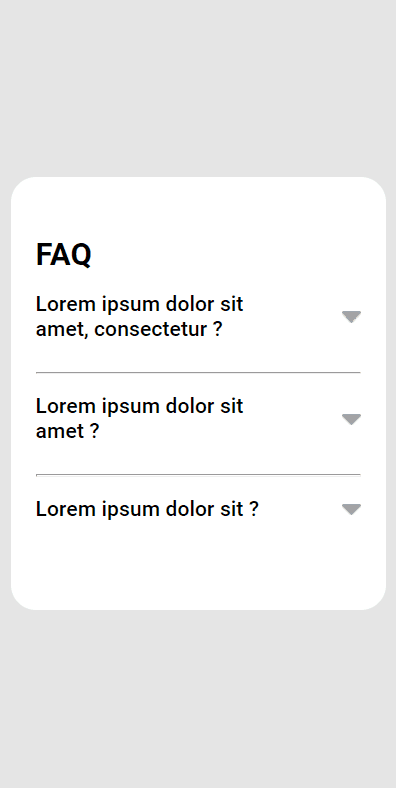
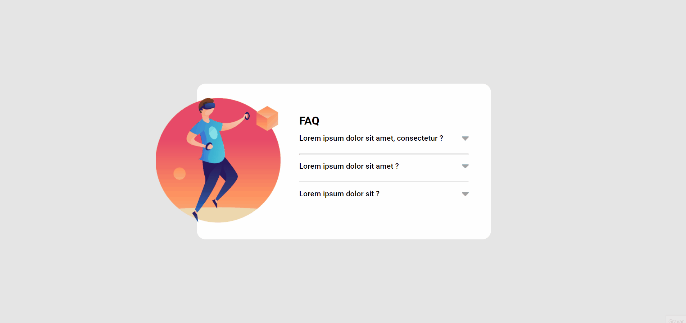

<h1 align="center">
   FAQ Accordion
</h1>

 

## 💻 Projeto

FAQ com animação estilo acordeon feito com JavaScript para mostrar as respostas e trocar a cor das setas.

## 📷 Demonstração

  ### Mobile 📱  
  

   
  
  ### Desktop 💻
  

 

## 🚀 Tecnologias utilizadas:

✔️ JAVASCRIPT

✔️ HTML

✔️ CSS